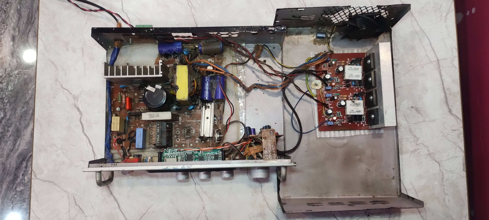
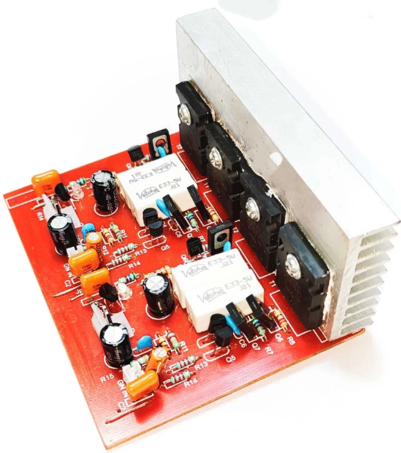
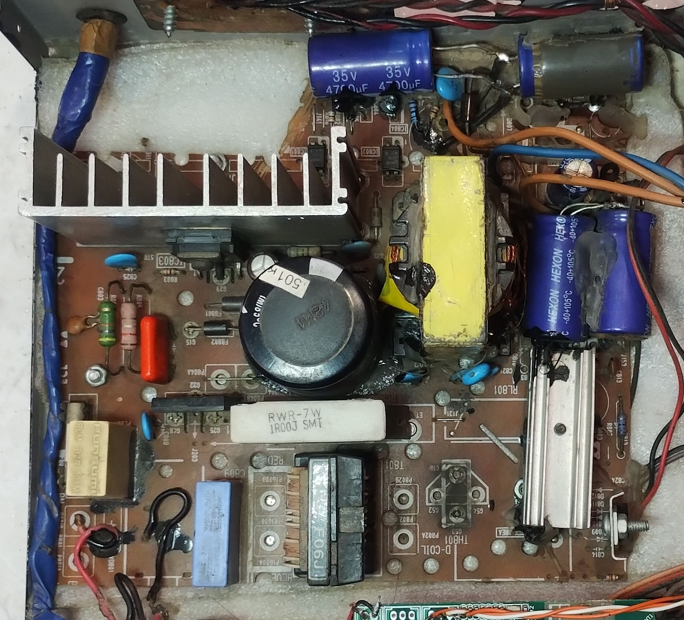
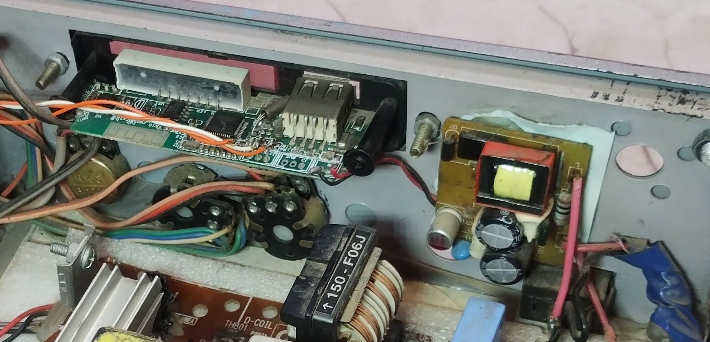

# Power-audio-Amplifier

## Amplifier board
This Power audio amplifier uses a class AB amplifier bassed on the transistor 2SC5200 and 2SA1943. This is a sterio board with two input and two output with recommended input supply voltage +30 0 -30 volt. The circuit board is easily available in the market.

## Power supply
The power is provided by a SMPS of a CRT TV( LG FLATRON 22 INCH ). SMPS is cut out from the entire board. By default it is set to provide 110v. To change it's output voltage following modification has been done.
* The secondary winding of switching transformer is removed without disturbing primary winding. The number of turns of secondary winding and auxiallary winding is counted.
* Two symmetrical secondary windings are wounded ( As we need symetrical supply of 30-0-30). Number of turns in winding is reduced in proportional to the original voltage(110v) and new voltage(30v).
* Additional rectifier and capacitor is installed as an extra winding is introduced.
* TL431 is used instead of SE110 in feedback loop.
  

## Bluetooth module
It provides audio signals from one of the sources (Bluetooth, Aux input, FM, SD card or USB storage). This module is powered from a separate 5V SMPS.

## Tone control circuit
This amplifier board does not have a built in tone control circuity. The tone control circuit of another amplifier is used here.

* To keep everything cool, a fan is installed.
* High voltage section(directly connected to mains) is separated from other parts for safety. 
